# 🏆 PROVELT

> **Prove Your Skills, Earn Rewards** – Web3 Social Skill-Challenge Platform with Yield-Bearing NFT Badges on Mantle Network

[](https://nextjs.org/)
[](https://www.typescriptlang.org/)
[](https://mantle.xyz/)
[](https://supabase.com/)
[](https://soliditylang.org/)

---

## 🎯 What is PROVELT?

PROVELT is a gamified social platform where users:
1. **Complete daily skill challenges** across various categories
2. **Earn ERC-721 NFT badges** minted on Mantle Network
3. **Stake badges to earn PRVLT tokens** (yield-bearing RWA)

Think of it as **Instagram stories + DuoLingo + DeFi staking** in one platform.

---

## 💰 How It Works

```
┌─────────────┐    ┌─────────────┐    ┌─────────────┐    ┌─────────────┐
│   Complete  │───▶│   Submit    │───▶│  Earn Badge │───▶│ Stake Badge │
│  Challenge  │    │   Proof     │    │    (NFT)    │    │ Earn PRVLT  │
└─────────────┘    └─────────────┘    └─────────────┘    └─────────────┘
```

### Step-by-Step Flow:
| Step | Action | Result |
|------|--------|--------|
| 1 | Connect wallet & sign message | Authenticated with Supabase |
| 2 | Browse and select a challenge | View challenge details |
| 3 | Upload proof (photo/video) | Submission pending review |
| 4 | Admin approves submission | **Badge NFT minted to wallet** |
| 5 | Go to Earn page & stake badge | Badge locked in vault |
| 6 | Wait & claim | **PRVLT tokens earned daily** |

### 📈 PRVLT Yield Rates (per day):
| Badge Difficulty | Daily Yield |
|-----------------|-------------|
| 🟢 Easy | 1 PRVLT |
| 🟡 Medium | 3 PRVLT |
| 🟠 Hard | 5 PRVLT |
| 🔴 Expert | 10 PRVLT |

---

## ✨ Features

| Feature | Description |
|---------|-------------|
| 🎯 **Daily Challenges** | New skill challenges every day across multiple categories |
| 📸 **Proof Submissions** | Upload photos, videos, or text as proof of completion |
| 🏆 **NFT Badges** | ERC-721 NFTs minted on Mantle for completed challenges |
| 💰 **Yield Staking** | Stake badges to earn PRVLT tokens daily (RWA/DeFi) |
| 📜 **On-Chain Proof** | Challenge completions verified and logged on blockchain |
| 📱 **TikTok-style Feed** | Infinite scroll feed of community submissions |
| 👛 **Multi-Wallet Support** | MetaMask, WalletConnect, Coinbase Wallet, Rainbow |
| 🔥 **Streaks & XP** | Build daily streaks with multiplier rewards |
| 👤 **User Profiles** | Showcase badges, submissions, and achievements |

---

## 🛠️ Tech Stack

```
Frontend             Backend              Blockchain
─────────────        ─────────────        ─────────────
Next.js 14           Supabase             Mantle Network (L2)
TypeScript 5         PostgreSQL           Solidity 0.8.20
TailwindCSS 3        Realtime             wagmi + viem
React Query          Storage (S3)         RainbowKit
Framer Motion        Edge Functions       ethers.js v6
```

### Smart Contracts:
| Contract | Description | Address (Sepolia) |
|----------|-------------|-------------------|
| `ProveltBadge.sol` | ERC-721 Badge NFTs | `0xc079d4dcfae3250ba38fbf9323676d1f53256ab5` |
| `PRVLTToken.sol` | ERC-20 Reward Token | `0xd707f900be8386c7bb094d21d90cc17202773208` |
| `ProveltStaking.sol` | Badge Staking Vault | `0x98c3Fadf7BB455dA84e11220D9D52dcd500CB43C6` |

---

## 🚀 Quick Start

### Prerequisites
- **Node.js** 20+ (LTS recommended)
- **npm** or **pnpm**
- **EVM Wallet** (MetaMask) with testnet MNT
- **Supabase** account for database

### 1. Clone & Install

```bash
git clone https://github.com/Heeeevi/Provelt_Solidity.git
cd Provelt_Solidity

# Install frontend dependencies
npm install

# Install smart contract dependencies
cd contracts && npm install && cd ..
```

### 2. Environment Setup

```bash
cp .env.example .env.local
```

Configure `.env.local`:
```env
# Supabase
NEXT_PUBLIC_SUPABASE_URL=https://your-project.supabase.co
NEXT_PUBLIC_SUPABASE_ANON_KEY=your_anon_key
SUPABASE_SERVICE_ROLE_KEY=your_service_role_key

# Mantle Network
NEXT_PUBLIC_MANTLE_NETWORK=sepolia
NEXT_PUBLIC_MANTLE_RPC_URL=https://rpc.sepolia.mantle.xyz
NEXT_PUBLIC_BADGE_CONTRACT_ADDRESS=0xc079d4dcfae3250ba38fbf9323676d1f53256ab5
NEXT_PUBLIC_PRVLT_TOKEN_ADDRESS=0xd707f900be8386c7bb094d21d90cc17202773208
NEXT_PUBLIC_STAKING_CONTRACT_ADDRESS=0x98c3Fadf7BB455dA84e11220D9D52dcd500CB43C6

# Treasury (for minting badges)
TREASURY_PRIVATE_KEY=0x_your_private_key

# WalletConnect (optional)
NEXT_PUBLIC_WALLETCONNECT_PROJECT_ID=your_project_id
```

### 3. Run Development Server

```bash
npm run dev
```

Visit `http://localhost:3000`

### 4. Deploy Smart Contracts (Optional)

```bash
cd contracts

# Compile
npx hardhat compile

# Deploy Badge NFT
npx hardhat run scripts/deploy.js --network mantleSepolia

# Deploy Staking System
npx hardhat run scripts/deployStaking.js --network mantleSepolia
```

---

## 📂 Project Structure

```
Provelt_Solidity/
├── contracts/                  # Smart Contracts
│   ├── src/
│   │   ├── ProveltBadge.sol   # ERC-721 Badge NFT
│   │   ├── PRVLTToken.sol     # ERC-20 Reward Token
│   │   └── ProveltStaking.sol # Staking Vault
│   └── scripts/
│       ├── deploy.js          # Badge deployment
│       └── deployStaking.js   # Staking deployment
├── src/
│   ├── app/                   # Next.js App Router
│   │   ├── page.tsx           # Homepage
│   │   ├── feed/              # Social feed
│   │   ├── challenges/        # Challenge pages
│   │   ├── staking/           # PRVLT staking UI
│   │   └── profile/           # User profiles
│   ├── components/            # React components
│   ├── lib/
│   │   ├── mantle/            # Blockchain utils
│   │   └── supabase/          # Database clients
│   └── hooks/                 # Custom React hooks
└── supabase/                  # Database migrations
```

---

## 🔐 Authentication Flow

PROVELT uses **wallet-based authentication**:

1. User connects wallet (MetaMask/WalletConnect)
2. User signs message: `"Sign in to PROVELT..."`
3. Server verifies signature
4. Supabase session created
5. User profile linked to wallet address

---

## 🎮 User Journey

```mermaid
graph LR
    A[🏠 Homepage] --> B[🔗 Connect Wallet]
    B --> C[✍️ Sign Message]
    C --> D[🎯 Browse Challenges]
    D --> E[📸 Submit Proof]
    E --> F[⏳ Pending Review]
    F --> G[✅ Approved]
    G --> H[🏆 Badge Minted]
    H --> I[💰 Stake Badge]
    I --> J[📈 Earn PRVLT Daily]
    J --> K[💵 Claim Rewards]
```



---

## 📜 License

MIT License - see [LICENSE](LICENSE) for details.

---

## 🌐 Links

- **Live Demo**: https://provelts.netlify.app
- **Documentation**: This README
- **Smart Contracts**: [Mantlescan](https://sepolia.mantlescan.xyz)

---

<div align="center">

**Built for Mantle Global Hackathon 2025** 🚀

*Turn your skills into yield-bearing assets.*

</div>
